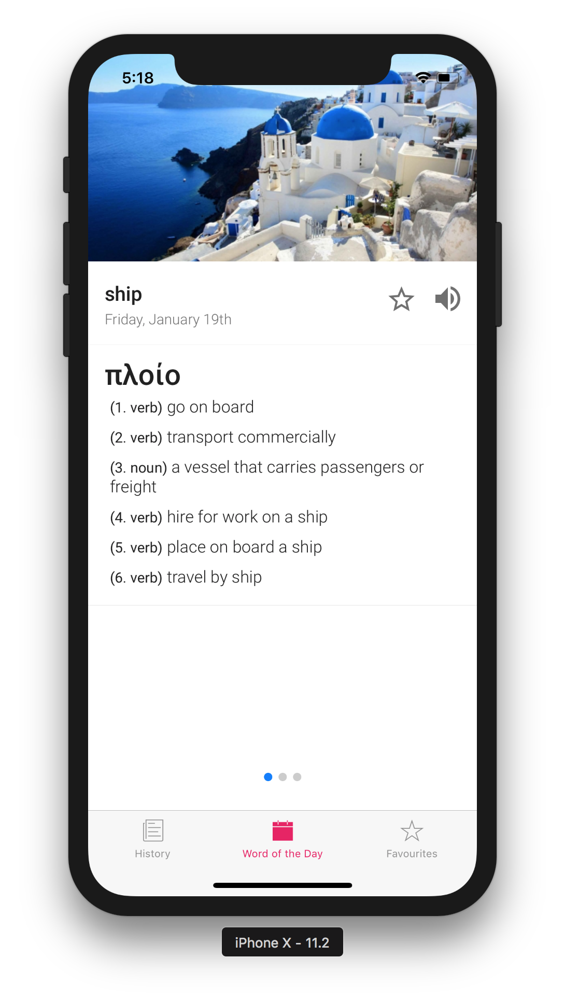

# Lexi

iOS app for showing a random Greek Word of the Day.

https://expo.io/@gaving/lexi

[](site/1.png)

### Developing

Edit `config.json` to configure your Google translate and wordsapi.com key.

```js
{
  "GOOGLE_TRANSLATE_API_KEY": "key",
  "WORD_API_KEY": "key"
}
```

Then build and run the app:-

```bash
yarn && yart start
```

### Download on iOS

The iOS version can be found here 👉 [App Store](https://itunes.apple.com/us/app/lexi-greek-word-of-the-day/id1299483660?ls=1&mt=8)
